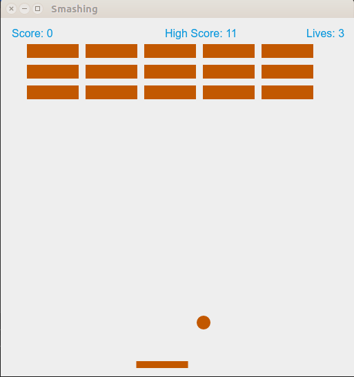

# Breakout

[](https://gitter.im/breakout-electronjs/breakout?utm_source=badge&utm_medium=badge&utm_campaign=pr-badge&utm_content=badge)

**Breakout is a Desktop game developed using Electron and Javascript**

The application basically contains the following files:

- `package.json` - Points to the app's main file and lists its details and dependencies.
- `main.js` - Starts the app and creates a browser window to render HTML. This is the app's **main process**.
- `index.html` - A web page to render. This is the app's **renderer process**.

## To Use

To clone and run this repository you'll need [Git](https://git-scm.com) and [Node.js](https://nodejs.org/en/download/) (which comes with [npm](http://npmjs.com)) installed on your computer. From your command line:

```
# Clone this repository
git clone https://github.com/jajodiaraghav/Breakout.git
# Go into the repository
cd Breakout
# Install dependencies and run the app
npm install && npm start
```

**Illustration**


